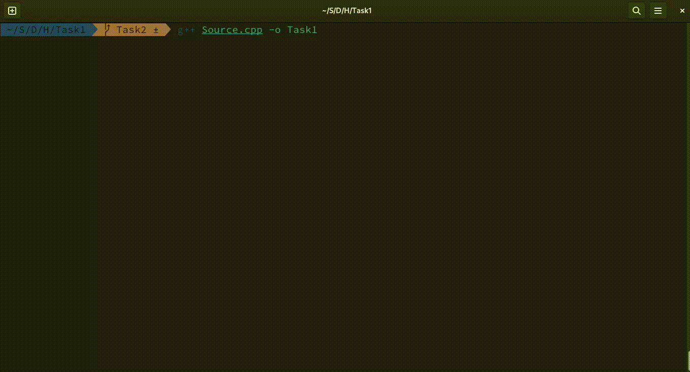
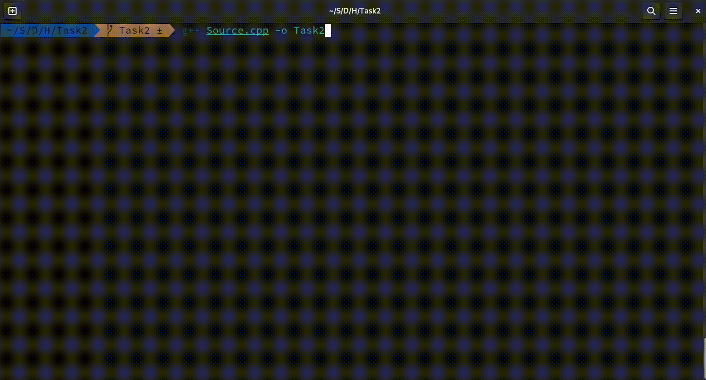

# DSA Homework 3

Third homework for our classes at Algebra University in Erasmus.

---

## Task 1
For the first task you need to change `system("clear")` to `system("cls")` as I'm under Linux fedora and not windows.
I tried to upload a gif but because of the clear there seem to be a lag
and nothing is showing.
Here is the gif but it's only showing at the end

---

## Task 2

For the second task I used an A\* algorithm. I found the template on GeeksForGeeks and adapted it for our purpose.
Same as the first task for the video and the `system()` calls.
**Some difference**:
        - Each time the wall are generated randomly
        - So you might have a wall on your starting position
        - When this happen the program will tell you and stop

